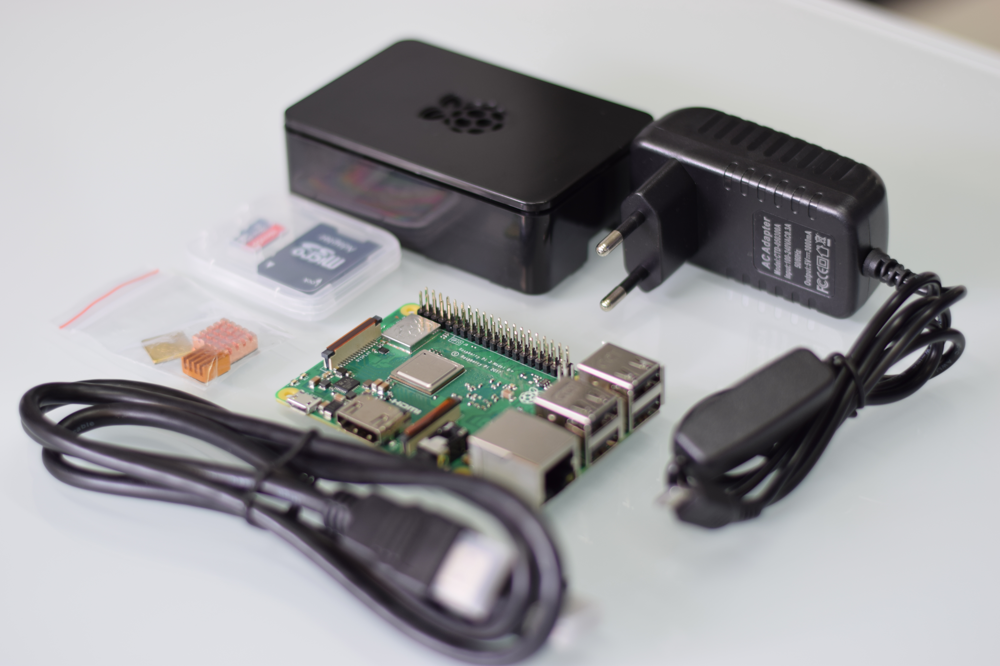

# Sklapamo Raspberry Pi i instaliramo Raspbian

## Šta nam je sve potrebno
* Raspberry Pi Model B+
* Micro SD kartica 8GB ili veća
* Napajanje
* HDMI kabal za povezivanje sa TV-om ili monitorom
* Kutija
* USB tastatura i miš

## Instaliranje Rasbpian operativnog sistema

Raspbian je popularna distribucija Debian Linux operativnog sistema prilagođena Raspberry Pi računarima.

